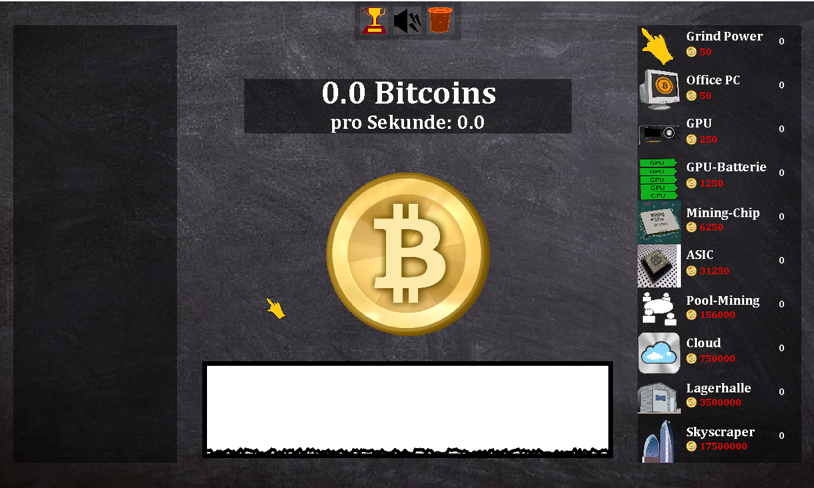
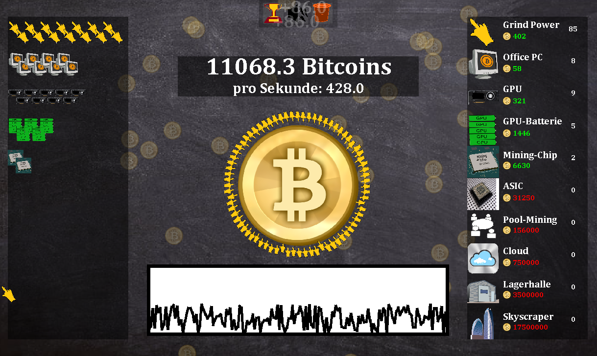
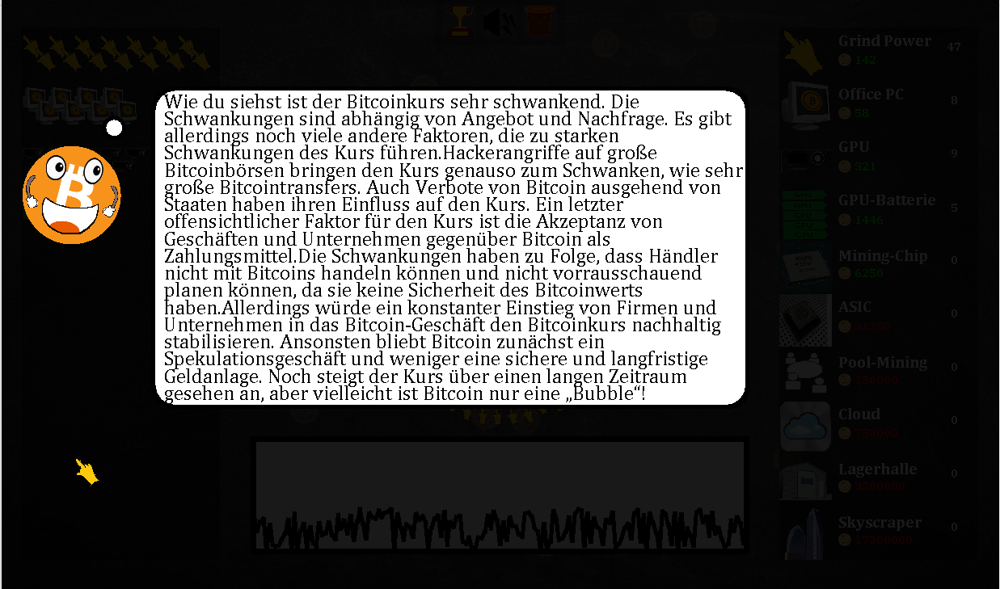

# BitcoinClicker
Educational, German game about Bitcoin and the Blockchain. You start with zero bitcoins and perhaps zero knowledge about the blockchain and bitcoins.

  

Through mining bitcoins by manual labor and smart investments, you can eventually become a bitcoin-billionaire

  

all while Bitti, the bitcoin lectures you about the blockchain and bitcoin. Once you max out your bitcoin empire you will will hopefully have also maxed out your blockchain and bitcoin knowledge!

  

Can you unlock all achievements?

  

# Credits
Big thanks to Nguyen K., Lennart K., Laurin K., Yaesin S., Adnan Q., Moritz B., Marvin S., and Christopher K. for creating the info-texts as well as the graphics!

# Java version
The source code is written for Java 7 (51) and the .jar was compiled with the same version.
