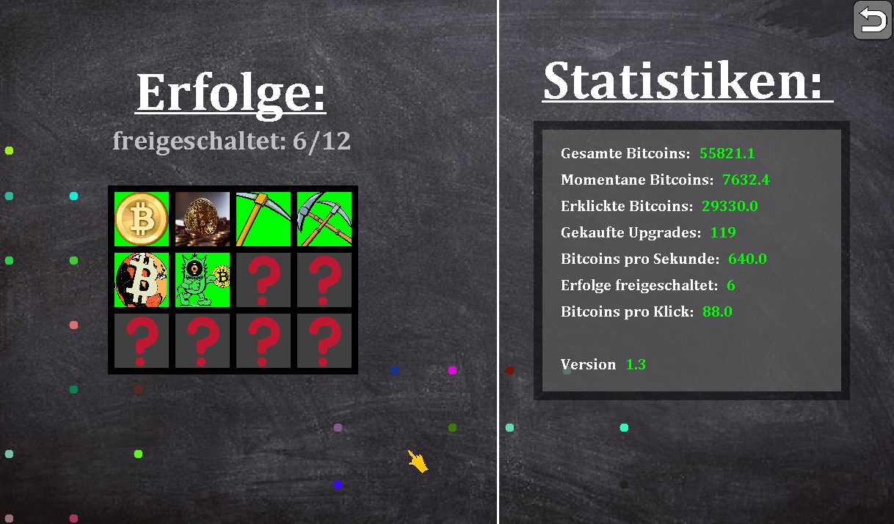

# BitcoinClicker
Educational, German game about Bitcoin and the Blockchain. Start with 0 bitcoins and knowledge

  

and later become a bitcoin-billionaire by mining bitcoins through clicks and smart investments

  

all while Bitti, the bitcoin lectures you about the blockchain and bitcoin.

  

Can you unlock all achievements?

  

# Credits
Big thanks to Nguyen K., Lennart K., Laurin K., Yaesin S., Adnan Q., Moritz B., Marvin S., and Christopher K. for creating the info-texts as well as the graphics!

# Java version
The source code is written for Java 7 (51) and the .jar was compiled with the same version.
